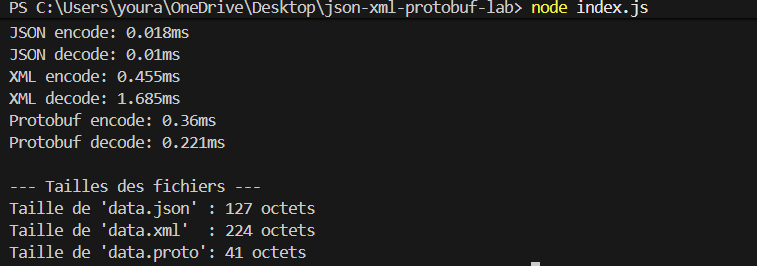

# JSON, XML, and Protobuf Serialization Lab

This project demonstrates how to serialize data in Node.js using three different formats:
- **JSON** (JavaScript Object Notation)
- **XML** (Extensible Markup Language)
- **Protobuf** (Protocol Buffers)

## Overview

The script `index.js` performs the following:
1. Creates a list of employees in memory.
2. Serializes this data to JSON, XML, and Protobuf.
3. Writes the output to `data.json`, `data.xml`, and `data.proto`.
4. Compares the file sizes and encoding/decoding performance.

## Results

As shown in the screenshot below, Protobuf offers the smallest file size and competitive performance.



## Usage

1. Install dependencies:
   ```bash
   npm install
   ```
2. Run the script:
   ```bash
   node index.js
   ```
